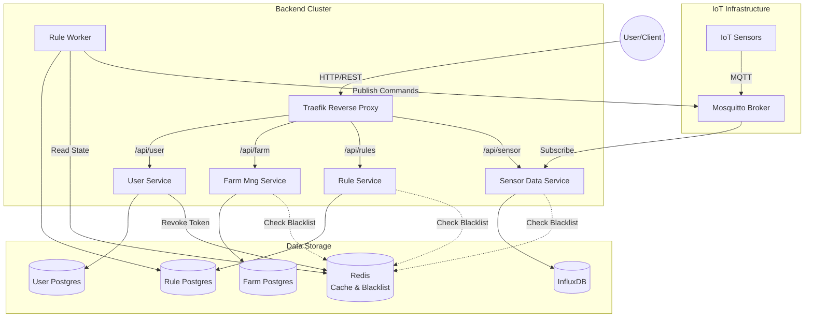

# 🚀 SmartFarm: An IoT Platform for Smart Agriculture

## 🌟 About The Project

**SmartFarm** is your farm's digital brain! Built using cutting-edge microservices, it handles all the heavy lifting so you don't have to worry about manual checks. It's designed to move your operation from guesswork to intelligent, automated control.

The system works like this: it uses high-speed data collection (MQTT) to instantly gather sensor readings, stores everything safely in InfluxDB and Redis, and then feeds that data into its dedicated Rules Engine. This engine is what makes the decisions, automatically telling your pumps and fans when and how to run based on your custom rules. This way, your crops always get exactly what they need, leading to healthier growth and better yields! 🌱🤖

---

## 🏗️ System Architecture

The system is built on the asynchronous FastAPI framework and is fully containerized using Docker. Sensor data is ingested via the MQTT protocol and stored in a time-series database (InfluxDB), while user and device metadata is managed in a PostgreSQL database.



## 🔧 Tech Stack

| Domain            | Technologies                                     |
|-------------------|--------------------------------------------------|
| **Backend** | Python 3.11, FastAPI, SQLAlchemy, Pydantic, Rule Engine, Redis    |
| **Databases** | PostgreSQL (Relational), InfluxDB (Time-Series)        |
| **Messaging** | Mosquitto MQTT Broker                            |
| **DevOps** | Docker, Docker Compose                           |
| **Async** | Asyncio, aiohttp, aiomqtt                        |

---

## ✨ Key Features & Technical Highlights

This project was a great opportunity to solve several interesting engineering challenges:

* **✅ Secure Authentication & Authorization:** Developed a robust security layer using **JWT tokens**. Implemented role-based access control (RBAC) to protect endpoints, distinguishing between regular users and administrators.
* **✅ Real-Time Data Ingestion:** Engineered an asynchronous pipeline with an **MQTT broker** to handle high-throughput data streams from potentially thousands of IoT sensors.
* **✅ Time-Series Data Management:** Integrated **InfluxDB** to efficiently store, query, and analyze time-series data (e.g., "fetch temperature readings from Sensor X over the last 24 hours").
* **✅ Resilient Microservices Architecture:** Designed a distributed system by decoupling logic into independent services (**User Service**, **Farm Management Service**, **Sensor Data Service**, **Rule Service**). Each service is containerized with **Docker** for isolation and scalability.
* **✅ Automation workflows:** Implement a rule engine to allow users to create custom automation workflows (e.g., "if soil moisture drops below 30%, turn on sprinklers for 5 minutes").

---

## 🛠️ Getting Started & Local Setup

You can get a local instance up and running easily with Docker.

1.  **Clone the repository:**
    ```sh
    git clone https://github.com/arseniyvolkow/IoTSmartFarm.git
    cd smartfarm
    ```
2.  **Configure your environment:**
    Create a `.env` file in the root directory (you can copy `example.env` as a template) and fill in your credentials for PostgreSQL, InfluxDB, etc.
3.  **Launch the application:**
    ```sh
    docker-compose up --build
    ```
    Once the containers are running, the API documentation for each service will be available at:
    * User Service Docs: `http://localhost/api/user-service/docs`
    * Farm Management Service Docs: `http://localhost/api/farm-management-service/docs`
    * Rule Service Docs: `http://localhost/api/rule-service/docs`
    * Sensor Data Retrieval Service Docs: `http://localhost//api/sensor-data/docs` 
---

## 📚 API Endpoints

<details>
<summary>Click to expand the complete API endpoint list</summary>

### User Service
- **Purpose**: Provides authentication (JWT-based) and user management functions.
- **Key Features**: User registration, role assignment, token generation/validation, and administrative user management.
- **Endpoints**:
  * **Auth Router** (Public/Session):  
    - `POST /auth/register`- Register a new account.  
    - `POST /auth/token`- Login via Email/Password. Returns **Access \+ Refresh** tokens.  
    - `POST /auth/refresh` - Refresh an expired Access token using a valid Refresh token.  
    - `POST /auth/logout` - Secure logout (revokes token via Redis Blacklist).  
  * **User Profile** (Self-Service \- /users/me):  
    - `GET /users/me` - Get current user's profile details.  
    - `PUT /users/me`- Update self profile (Email, Password, Avatar).  
    - `DELETE /users/me` - Delete self account (Self-service).  
  * **User Management** (Admin Only \- /users):  
    - `GET /users` - List all users (Requires users:read).  
    - `GET /users/{id}` - Get details of a specific user.  
    - `PUT /users/{id}` - Admin update (Email, Ban status, Active status) (Requires users:write).  
    - `POST /users/{id}/role` - Assign a role to a user (Requires roles:write).  
    - `DELETE /users/{id}` - Force delete/ban a user (Requires users:delete).  
  * **RBAC Management** (Super Admin Only \- /admin/roles):  
    - `GET /admin/roles` - List all available roles.  
    - `POST /admin/roles` - Create a new Role (e.g., "Agronomist").  
    - `GET /admin/roles/{name}` - View role details and permissions.  
    - `POST /admin/roles/{name}/permissions` - Configure resource permissions (e.g., give read access to "farms").  
    - `DELETE /admin/roles/{name}` - Delete a role.

### Farm Management Service
- **Purpose**: Handles operations related to farm devices, crop management, and overall farm structure.
- **Key Features**: Full CRUD for devices, farms, and crops. Firmware update handling. Association of devices to farms.
- **Device Endpoints**:
    - `POST /device` - Registers a new device, used only by device itself.
    - `GET /list-of-new-devices` - Get all new devices which were not yet assigned to user.
    - `GET /unsigned-devices` - Lists devices not yet assigned to any farm.
    - `GET /all-devices` - Lists all devices registered under the current user.
    - `GET /all-devices/{farm_id}` - Lists devices specific to a given farm.
    - `PATCH /assign-device-to-farm` - Associates a device with a specific farm.
    - `PATCH /device/{device_id}` - Updates the status or configuration of a device.
    - `DELETE /device/{device_id}` - Removes a device from the system.
    - `POST /upload_firmware/{device_id}` - Uploads and updates the firmware of a device.
- **Actuators Endpoints**:
    - `GET /actuator/{actuator_id}` - Get actuators details.
    - `GET /all` - Get all users actuators.
    - `PUT /actuator/{actuator_id}` - Update actuator info.
    - `DELETE /actuator/{actuator_id}` - Delete actuator.
- **Sensor Endpoints**:
    - `GET /sensor/{sensor_id}` - Retrives details about a specific sensor.
    - `GET /all` - Fetches a list of all sensor which user have access to.
    - `PUT /sensor/{sensor_id}` - Update sensors information.
    - `DELETE /sensor/{sensor_id}` - Removes sensor
- **Farm Endpoints**:
    - `POST /farm` - Creates a new farm record.
    - `GET /all` - Retrives all users farms.
    - `GET /farm/{farm_id}` - Retrieves detailed information about a specific farm.
    - `PUT /farms/farm/{farm_id}` - Updates existing farm information.
    - `PATCH /farms/farm/{farm_id}` - Assigns a crop to the farm.
    - `DELETE /farms/farm/{farm_id}` - Deletes a farm record.
- **Crop Endpoints**:
    - `POST /crop` - Adds a new crop management entry.
    - `GET /crop/{crop_id}` - Retrieves details about a specific crop management entry.
    - `PUT /crop/{crop_id}` - Updates an existing crop management entry.
    - `GET /all` - Fetches a list of all available crop managmaent entries.
    - `POST /crop-type` - Creates a new crop type.
    - `GET /all-crop-types` - Fetches a list of all available crop types.

### Sensor Data Service
- **Purpose**: Receives sensor readings through MQTT and stores them in InfluxDB for time-series analysis.
- **Key Features**: Subscribes to MQTT topics, parses sensor payloads, and provides endpoints to query historical data.
- **Endpoints**:
    - `GET /health` - Performs a health check on the sensor data service.
    - `POST /simulate-sensor-data` - Simulates sensor data input for testing purposes.
    - `GET /device_data/{device_id}/{sensor_type}/{time}` - Queries time-series data for a specified device and sensor.
    - `POST /actuator-mode-update` - Update actuators mode.
    - `GET /sensor-data/{sensor_id}/{time}` - Get time series data for a specific sensor_id.

### Rule Service
- **Purpose**: Handles operations related to rules and rules actions.
- **Key Features**:  Let you create rules which will control actuators based on time or sensors values.
- **Endpoints**:
    - `GET /rule/{rule_id}` - Get details about rule
    - `POST /rule/` - Creates new rule and rule's actions
    - `GET /all/ ` - Get all users rules, can be filtered by farm_id, sensor_id or trigger_type
    - `PUT /rule/{rule_id}` - Update rule's information
    - `DELETE /rule/{rule_id}` - Delete rule
</details>

---

## 🎯 Future Plans & Roadmap


-   [ ] Increase test coverage to 80% using **Pytest**.
-   [ ] Set up a **CI/CD pipeline** with GitHub Actions for automated testing and builds.

---

