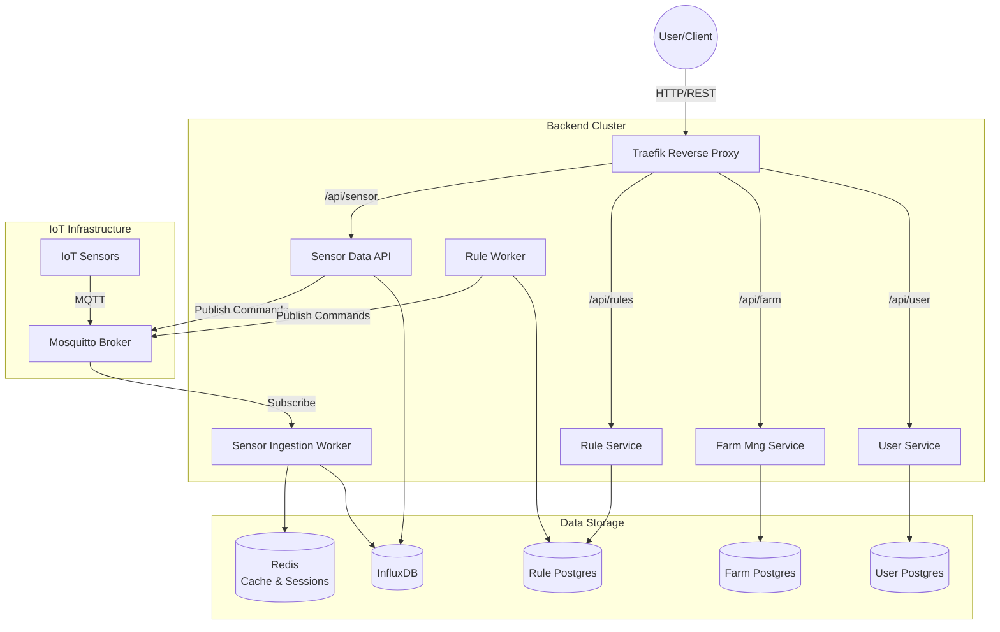

# 🚀 SmartFarm: An IoT Platform for Smart Agriculture

## 🌟 About The Project

**SmartFarm** is your farm's digital brain! Built using cutting-edge microservices, it handles all the heavy lifting so you don't have to worry about manual checks. It's designed to move your operation from guesswork to intelligent, automated control.

The system works like this: it uses high-speed data collection (MQTT) to instantly gather sensor readings, stores everything safely in InfluxDB and Redis, and then feeds that data into its dedicated Rules Engine. This engine is what makes the decisions, automatically telling your pumps and fans when and how to run based on your custom rules. This way, your crops always get exactly what they need, leading to healthier growth and better yields! 🌱🤖

---

## 🏗️ System Architecture

The system is built on the asynchronous FastAPI framework and is fully containerized using Docker. It implements a **CQRS (Command Query Responsibility Segregation)** pattern for sensor data, separating high-volume ingestion from API retrieval.


```mermaid
graph TD
    Client((User/Client)) -->|HTTP/REST| Traefik[Traefik Reverse Proxy]

    subgraph "Backend Cluster"
        Traefik -->|/api/user| UserService[User Service]
        Traefik -->|/api/farm| FarmService[Farm Mng Service]
        Traefik -->|/api/rules| RuleService[Rule Service]
        Traefik -->|/api/sensor| SensorService[Sensor Data API]
        
        %% Dedicated Workers
        SensorIngestion[Sensor Ingestion Worker]
        RuleWorker[Rule Worker]
    end

    subgraph "Data Storage"
        UserService --> UserDB[(User Postgres)]
        FarmService --> FarmDB[(Farm Postgres)]
        RuleService --> RuleDB[(Rule Postgres)]
        RuleWorker --> RuleDB
        
        %% Optimized Ingestion Path
        SensorIngestion --> Influx[(InfluxDB)]
        SensorIngestion --> Redis
        
        SensorService --> Influx
        
        %% Redis is central for Auth, State & History Cache
        Redis[(Redis\nCache & Sessions)]
    end

    subgraph "IoT Infrastructure"
        IoT[IoT Sensors] -->|MQTT| Broker[Mosquitto Broker]
        Broker -->|Subscribe| SensorIngestion
        SensorService -->|Publish Commands| Broker
        RuleWorker -->|Publish Commands| Broker
    end
```

### Core Services

1. **User Service**: Handles Authentication (JWT), RBAC, and Async hashing.
2. **Farm Management Service**: Manages relational data for farms, devices, and sensors.
3. **Sensor Data API**: Serves real-time and historical data with Redis session and query caching.
4. **Sensor Ingestion Worker**: **(New)** Standalone service dedicated to parsing and saving the high-volume MQTT sensor data firehose.
5. **Rule Service & Worker**: Real-time automation and rule evaluation engine.

---

## 🔧 Tech Stack

| Domain            | Technologies                                     |
|-------------------|--------------------------------------------------|
| **Backend** | Python 3.11, FastAPI, Gunicorn (Multi-worker), SQLAlchemy, Redis    |
| **Databases** | PostgreSQL (Relational), InfluxDB (Time-Series)        |
| **Messaging** | Mosquitto MQTT Broker                            |
| **DevOps** | Docker, Docker Compose, Traefik                  |
| **Serialization** | Orjson (Fast Rust-based JSON)                    |

---

## ✨ Performance & Load Testing

The system is architected for high-concurrency and has been verified with the following benchmarks:

* **API Capacity**: ~800 Requests Per Second.
* **Ingestion Capacity**: ~14,900 Messages Per Second.

### 1. API Load Test (k6)

Simulates realistic user flows (login, dashboard, history).

```bash
k6 run load_test.js
```

### 2. MQTT Ingestion Stress Test

Tests the maximum throughput of the ingestion pipeline.

```bash
./.venv/bin/python mqtt_stress_test.py
```

---

## 🛠️ Getting Started & Local Setup

1. **Clone & Setup:**

    ```sh
    git clone https://github.com/arseniyvolkow/IoTSmartFarm.git
    cd smartfarm
    cp example.env .env
    ```

    *Note: Ensure your `.env` file uses the consolidated `postgres` host for the database variables (e.g., `POSTGRES_USER_DATABASE_HOST=postgres`), without any surrounding quotes.*

2. **Launch the Infrastructure:**

    ```sh
    docker compose up --build -d
    ```
    
    *The system uses a single, optimized PostgreSQL container that automatically provisions isolated logical databases (`dev_user_service_db`, `dev_farm_db`, `dev_rule_db`) for each microservice.*

3. **Run Database Migrations (Alembic):**

    Instead of relying on unstable startup scripts, this project uses Alembic to manage database schemas safely. After your containers are running, you must initialize the tables:

    ```sh
    docker compose exec user_service alembic upgrade head
    docker compose exec farm_management_service alembic upgrade head
    docker compose exec rule_service alembic upgrade head
    ```

    Once complete, the API documentation for each service will be available at:
    * User Service Docs: `http://localhost/api/user-service/docs`
    * Farm Management Service Docs: `http://localhost/api/farm-management-service/docs`
    * Rule Service Docs: `http://localhost/api/rule-service/docs`
    * Sensor Data API Docs: `http://localhost/api/sensor-data/docs`

---

## 🗄️ Managing Database Changes (Alembic)

When you update your SQLAlchemy models (e.g., adding a new column), do **not** drop your database. Use Alembic to generate and apply a migration:

1. **Generate the migration script:**
   ```sh
   docker compose exec <service_name> alembic revision --autogenerate -m "added_new_column"
   ```
2. **Apply the migration to the database:**
   ```sh
   docker compose exec <service_name> alembic upgrade head
   ```

---

## 📚 API Endpoints

<details>
<summary>Click to expand the complete API endpoint list</summary>

### User Service

* **Purpose**: Provides authentication (JWT-based) and user management functions.
* **Endpoints**:
  * **Auth Router**:  
    * `POST /auth/register`- Register a new account.  
    * `POST /auth/token`- Login via Email/Password. Returns **Access \+ Refresh** tokens.  
    * `POST /auth/refresh` - Refresh an expired Access token using a valid Refresh token.  
    * `POST /auth/logout` - Secure logout (revokes token via Redis Blacklist).  
  * **User Profile**:  
    * `GET /users/me` - Get current user's profile details.  
    * `PUT /users/me`- Update self profile (Email, Password, Avatar).  
    * `DELETE /users/me` - Delete self account.  
  * **User Management (Admin Only)**:  
    * `GET /users` - List all users.  
    * `GET /users/{id}` - Get details of a specific user.  
    * `PUT /users/{id}` - Admin update.  
    * `POST /users/{id}/role` - Assign a role to a user.  
    * `DELETE /users/{id}` - Force delete/ban a user.  
  * **RBAC Management (Super Admin Only)**:  
    * `GET /admin/roles` - List all available roles.  
    * `POST /admin/roles` - Create a new Role.  
    * `GET /admin/roles/{name}` - View role details.  
    * `POST /admin/roles/{name}/permissions` - Configure resource permissions.

### Farm Management Service

* **Purpose**: Handles operations related to farm devices, crop management, and overall farm structure.
* **Device Endpoints**:
  * `POST /device` - Registers a new device.
  * `GET /list-of-new-devices` - Get all new devices not yet assigned.
  * `GET /unsigned-devices` - Lists devices not yet assigned to any farm.
  * `GET /all-devices` - Lists all devices registered under the current user.
  * `PATCH /assign-device-to-farm` - Associates a device with a specific farm.
  * `PATCH /device/{device_id}` - Updates the status of a device.
  * `DELETE /device/{device_id}` - Removes a device from the system.
  * `POST /upload_firmware/{device_id}` - Uploads and updates device firmware.
* **Actuators Endpoints**:
  * `GET /actuator/{actuator_id}` - Get actuators details.
  * `GET /all` - Get all users actuators.
  * `PUT /actuator/{actuator_id}` - Update actuator info.
  * `DELETE /actuator/{actuator_id}` - Delete actuator.
* **Sensor Endpoints**:
  * `GET /sensor/{sensor_id}` - Retrives details about a specific sensor.
  * `GET /all` - Fetches a list of all sensor which user have access to.
  * `PUT /sensor/{sensor_id}` - Update sensors information.
  * `DELETE /sensor/{sensor_id}` - Removes sensor
* **Farm Endpoints**:
  * `POST /farm` - Creates a new farm record.
  * `GET /all` - Retrives all users farms.
  * `GET /farm/{farm_id}` - Retrieves detailed information about a specific farm.
  * `PUT /farms/farm/{farm_id}` - Updates existing farm information.
  * `DELETE /farms/farm/{farm_id}` - Deletes a farm record.

### Sensor Data Service

* **Purpose**: Serves sensor readings and historical analysis data.
* **Endpoints**:
  * `GET /health` - Performs a health check.
  * `GET /sensor-value/{sensor_id}` - Get real-time value from Redis cache.
  * `GET /sensor-data/{sensor_id}/{time}` - Get time-series history (Aggregated & Cached).
  * `POST /actuator-mode-update` - Update actuators mode via MQTT.

### Rule Service

* **Purpose**: Handles automation logic and rule configuration.
* **Endpoints**:
  * `GET /rule/{rule_id}` - Get details about rule
  * `POST /rule/` - Creates new rule and rule's actions
  * `GET /all/` - Get all users rules.
  * `PUT /rule/{rule_id}` - Update rule's information
  * `DELETE /rule/{rule_id}` - Delete rule

</details>

---

## 🎯 Future Plans & Roadmap

* [ ] Increase test coverage to 80% using **Pytest**.
* [ ] Set up a **CI/CD pipeline** with GitHub Actions for automated testing and builds.

---
